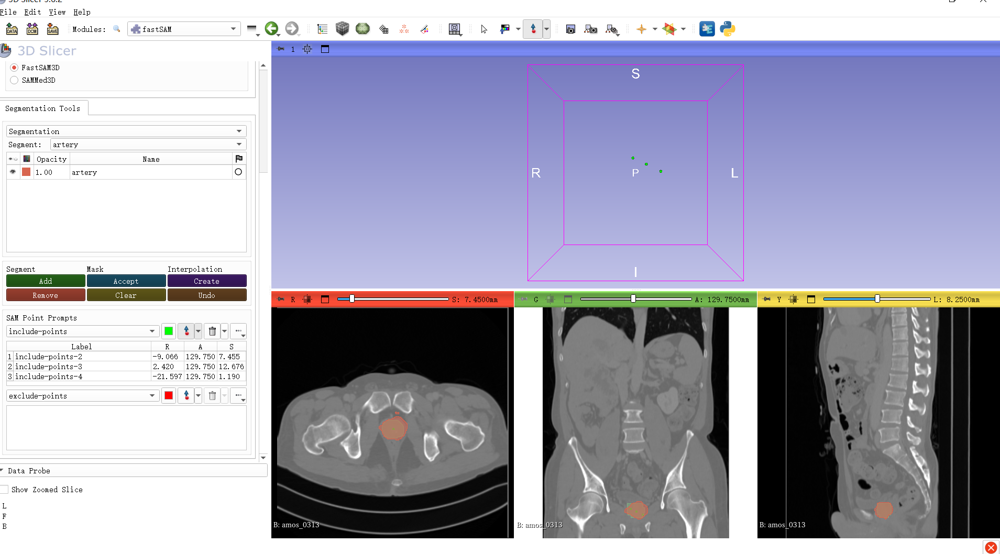
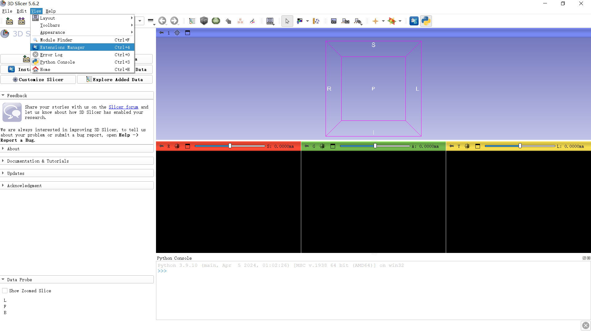
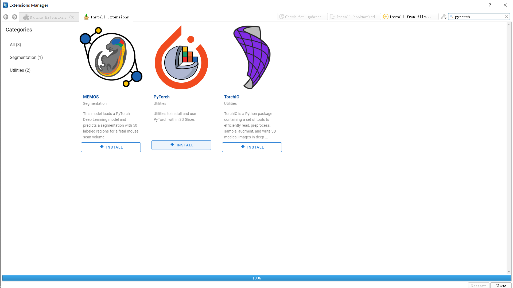
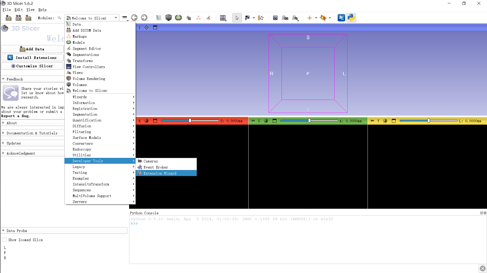
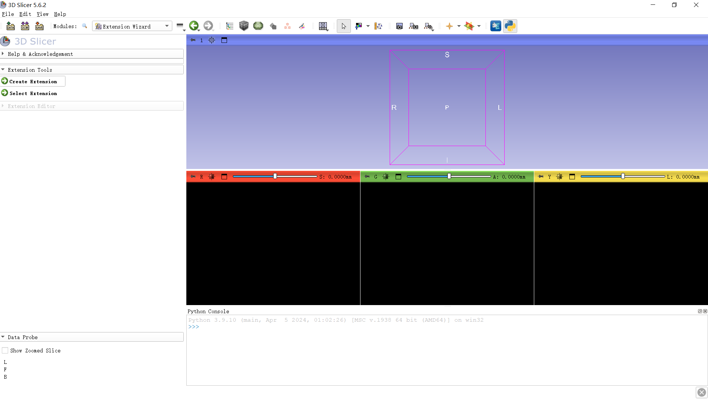
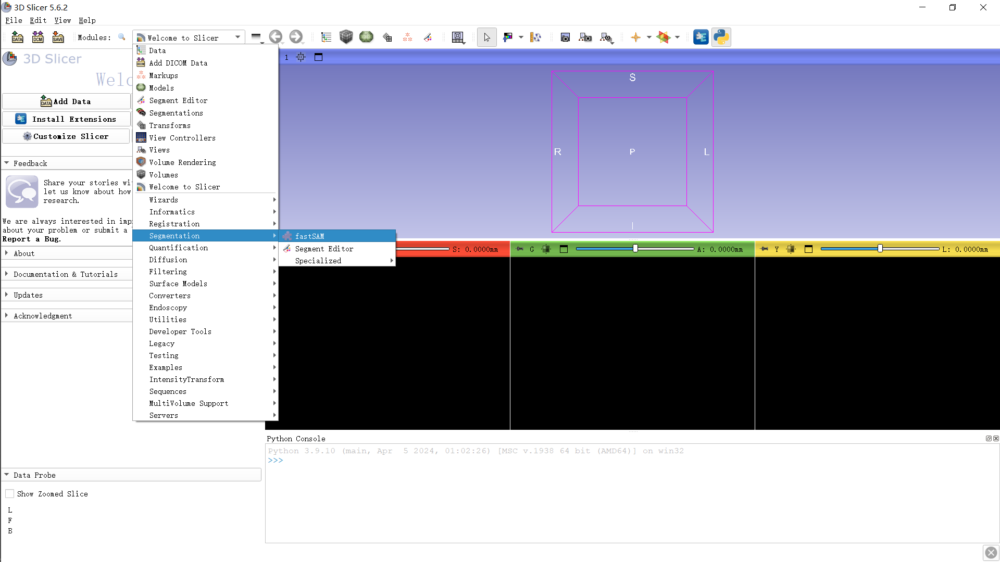

# Fast Segment-anything model in 3D medical image (FastSAM3D): A 3D Slicer extension for FastSAM3D.

[paper](https://arxiv.org/abs/2403.09827)
\
[code](https://github.com/arcadelab/FastSAM3D)
\
[ARCADE lab](https://arcade.cs.jhu.edu/), [Johns Hopkins University](https://www.jhu.edu/)
\


# Table of contents
- [Fast Segment-anything model in 3D medical image (FastSAM3D): A 3D Slicer extension to FastSAM3D](#fast-segment-anything-model-in-3d-medical-image-fastsam3d-a-3d-slicer-extension-for-fastsam3d)
- [Table of contents](#table-of-contents)
  - [Introduction ](#introduction-)
  - [Before You Try ](#before-you-try-)
  - [How to Use ](#how-to-use-)
    - [Features ](#features-)
  - [Citation ](#citation-)

## Introduction <a name="introduction"></a>
What are SAM, SAMMed3D, FastSAM3D and FastSAM3D_slicer?
* SAM is the vision foundation model developed by Meta, [Segment Anything](https://segment-anything.com).
* SAMMed3D is the 3D version of SAM based on medical image.
* FastSAM3D is the faster version of SAMMed3D.
* FastSAM3D_slicer is the 3D slicer extension based on FastSAM3D and SAMMed3D.
\
Why FastSAM3D and FastSAM3D_slicer?
* FastSAM3D is about 10 times faster compare with SAMMed3D, with small accuracy lose. 
* FastSAM3D_slicer provide an interface for user to do segmentation based on FastSAM3D for medical image intutively.
* And it's really fast! 
## Before You Try <a name="before-you-try"></a>
Make sure you have more than 3GB storage to download model weights and install pytorch.
Don't forget to use the provided resample.py file to do resample for medical image. 
## How to Use <a name="how-to-use"></a>
step 1: Download the file and compress it.

step 2: open 3D slicer and open extension manager, download the pytorch extension and restart the slicer.


step 3: open extension wizard in 3D slicer.

step 4: click the open extension and choose the folder contain the extension in step 1.

step 5: the extension now will be available in here

### Features <a name="features"></a>
- 3 View Inference
- Data type
  - NIFTI file
  - volume
- models
  - FastSAM3D
  - SAMMed3D
- interactions
  - include and exclude points
## Citation <a name="citation"></a>
If you use FastSAM3D_slicer in your research, please consider use the following BibTeX entry.

```bibtex
@misc{shen2024fastsam3d,
      title={FastSAM3D: An Efficient Segment Anything Model for 3D Volumetric Medical Images}, 
      author={Yiqing Shen and Jingxing Li and Xinyuan Shao and Blanca Inigo Romillo and Ankush Jindal and David Dreizin and Mathias Unberath},
      year={2024},
      eprint={2403.09827},
      archivePrefix={arXiv},
      primaryClass={eess.IV}
}
```

